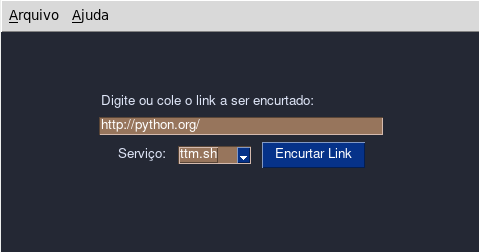

# PyShortenerURL

 

## O que é PyShortenerURL?

**PyShortenerURL** é um encurtador de links desenvolvido em Pyhon utilizando a biblioteca PySimplegui e shorteners. **PyShortenerURL** funciona em interface gráfica e encurta links em vários encurtadores, desta forma garante a disponibilidade de serviços, pois quando um serviço falha, geralmente outro estará disponível...

## Como ter o PyShortenerURL em seu computador?

Primeiramente certifique-se de ter o Python instalado em sua máquina: baixe o python [neste link](https://python.org)...

Agora clone este repositório em seu terminal ou prompt de comandos:
 
~~~python

git clone https://github.com/elizeubarbosaabreu/PyShortenerURL

~~~
 
**Atenção**:

Se você estiver usando o **Windows**, abra o prompt e entre com estes comandos:
 
~~~python

cd PyShortenerURL
python -m venv .venv
source .venv/Scripts/activate.bat
pip install -r requeriments.txt

~~~
 
Para **Linux** e outros, digite os seguintes comandos no terminal:
 
~~~python

cd PyShortenerURL
Edite este texto
aqui com seu códigopython3 -m venv .venv
source .venv/bin/activate
pip install -r requeriments.txt

~~~
 
Para testar se tudo está bem, digite o comando abaixo no terminal ou prompt de comando:
 
~~~python

python app.py

~~~

## Criando um menu, atalho para o software:

Se tudo funcionou bem, agora é hora de criar o link para que tudo funcione como software:

Crie um atalho apontado para o python da máquina virtual e para o app.py. No exemplo abaixo utilizei o *Alacarte* para criar o atalho:
 
~~~python

/home/pi/.local/opt/Short_URL/.venv/bin/python3 '/home/pi/.local/opt/Short_URL/app.py'

~~~

A parte */home/pi/.local/opt/* é a pasta onde eu salvei a pasta do projeto...

## Obrigado por usar nosso software!! Sinta-se a vontade para melhorá-lo, mas não esqueça de deixar uma estrelinha para nós...